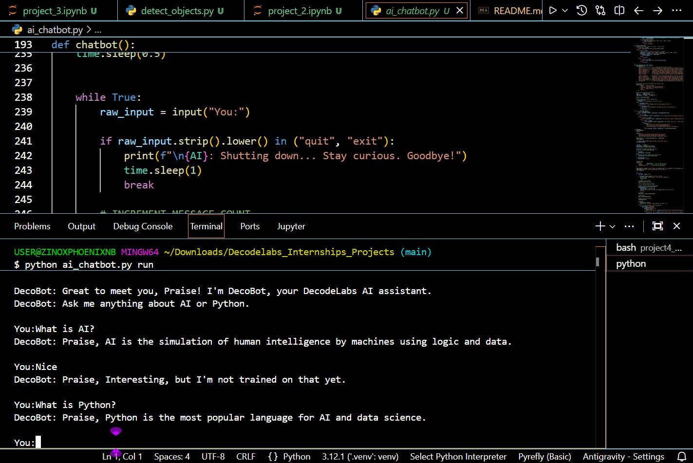
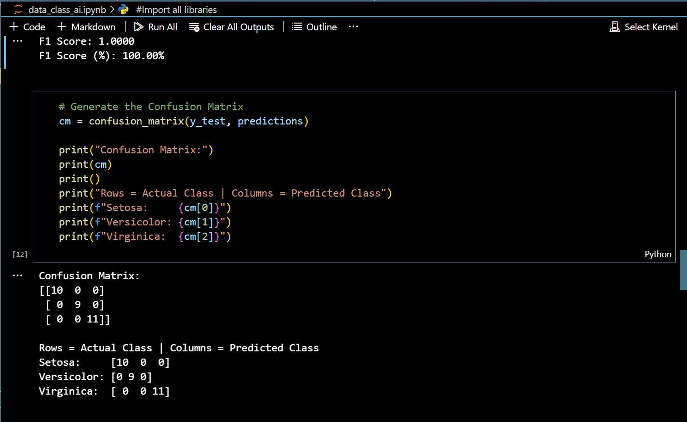
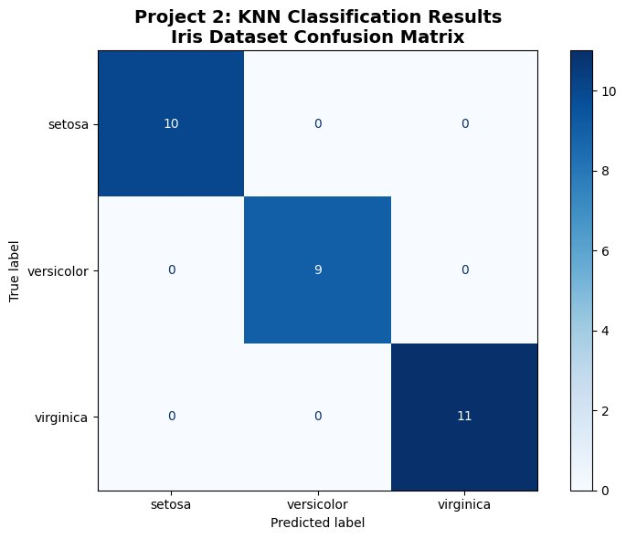
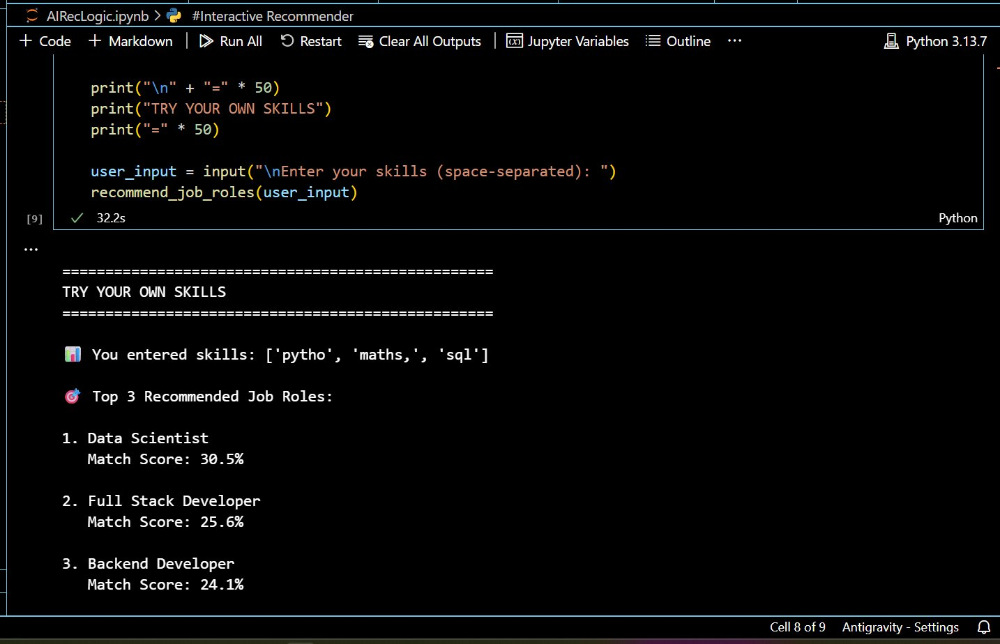
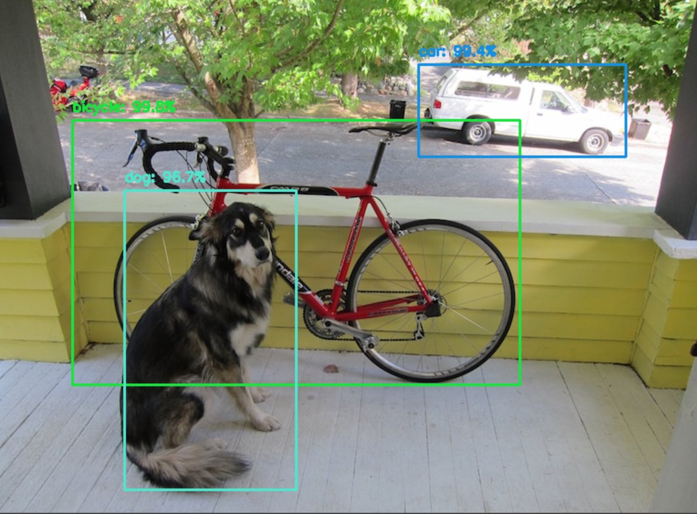

# DecodeLabs AI Internship
**Batch: 2026 | Intern: Nwadigo Praise**

A complete collection of 4 Artificial Intelligence projects built during the DecodeLabs Industrial Training Program. Each project represents a different branch of AI — from rule-based logic to computer vision.

---

## 📁 Project Overview

| Project | Title | Tech Stack | Status |
|---|---|---|---|
| Project 1 | Rule-Based AI Chatbot (DecoBot) | Python |  Complete |
| Project 2 | Data Classification Using AI | Python, Scikit-learn | omplete |
| Project 3 | AI Job Recommendation Engine | Python, Pandas, NLP | Complete |
| Project 4 | Image & Object Detection | Python, OpenCV, MobileNet-SSD | Complete |

---

## 🧠 Project 1: Rule Based AI Chatbot (DecoBot)

### Description
A fully interactive terminal based AI chatbot built using pure Python control flow and logic. DecoBot simulates real conversation using mood detection, memory, typing effects, and a structured knowledge base all without any ML libraries.

### Key Features
- Boot sequence with animated loading text
- Typing & thinking effects for natural user experience
- Mood detection (happy, angry, sad, confused, neutral)
- Input classification (greetings, questions, statements, acknowledgements)
- Name extraction and persistent memory bank
- Knowledge base with intelligent fallback responses
- Milestone messages at 5, 10, and 20 messages

### Screenshot
![Project 1 DecoBot Chatbot] 


### How to Run
```bash
python ai_chatbot.py
```
Type your name when prompted, then ask anything about AI or Python.
Type `quit` or `exit` to stop.

### File
```
ai_chatbot.py
```

### Skills Demonstrated
`Control Flow` `Dictionaries` `Functions` `String Processing` `Memory Systems`

---

## Project: 2 Data Classification Using AI

### Description
A supervised machine learning pipeline that classifies Iris flowers into 3 species (Setosa, Versicolor, Virginica) using the K-Nearest Neighbors algorithm. Achieves a perfect 100% F1 Score on the test set.

### Key Features
- Iris dataset loaded and explored (150 samples, 3 classes, 4 features)
- Feature scaling using StandardScaler (Mean=0, Variance=1)
- 80/20 Train-Test Split with shuffle to remove order bias
- KNN classifier with K=5 (majority vote)
- F1 Score validation
- Confusion Matrix with color-coded visual display

### Results
| Metric | Score |
|---|---|
| F1 Score | **100%** |
| Correct Predictions | 30/30 |
| False Positives (FP) | 0 |
| False Negatives (FN) | 0 |

### Screenshots
![Project 2 F1 Score 100%] 

![Project 2 - Confusion Matrix] 

### How to Run
```bash
jupyter notebook data_class_ai.ipynb
```
Run all cells sequentially using `Shift + Enter`

### File
```
data_class_ai.ipynb
```

### Requirements
```bash
pip install numpy pandas matplotlib scikit-learn jupyter
```

### Skills Demonstrated
`Supervised Learning` `KNN Algorithm` `Feature Scaling` `F1 Score` `Confusion Matrix` `Data Visualization`

---

## 🔍 Project 3: AI Job Recommendation Engine

### Description
An intelligent career recommendation system that matches a user's skills to the top 3 most suitable tech job roles using TF-IDF weighting and Cosine Similarity the same core technology behind search engines and recommendation systems.

### Key Features
- CSV dataset with 10 job roles and 29 unique skills
- Binary skill vectorization
- TF-IDF weighting (rare/specialized skills score higher)
- Cosine Similarity matching engine built from scratch
- Top 3 job role recommendations with match percentages
- Interactive user input cell for custom skill testing

### Screenshot
![Project 3 - Job Recommender Output] 

### How to Run
```bash
jupyter notebook AIRecLogic.ipynb
```
Run all cells, then enter your skills (space-separated) in the final cell.

### Files
```
AIRecLogic.ipynb
raw_skill.csv
```

### Requirements
```bash
pip install pandas jupyter
```

### Skills Demonstrated
`NLP` `TF-IDF` `Cosine Similarity` `Recommendation Systems` `Pandas` `Vectorization`

---

## Project 4: Image & Object Detection Pipeline

### Description
A computer vision pipeline that detects and identifies objects in images using the pre-trained MobileNet-SSD deep learning model. The system pre-processes images, runs them through the neural network, and draws labeled bounding boxes around all detected objects above 80% confidence.

### Key Features
- MobileNet-SSD object detection (21 object classes)
- Image pre-processing pipeline (blob construction, resize to 300x300, mean subtraction)
- 80% confidence threshold filter (Gatekeeper Rule)
- Colored bounding boxes with labels and confidence scores
- Output image saved automatically as `output_detected.jpg`

### Detection Results
| Object | Confidence |
|---|---|
| Dog | 95.7% |
| Bicycle | 99.5% |
| Car | 99.4% |

### Screenshot
![Project 4 - Object Detection Output] 

### How to Run
```bash
python detect_objects.py
```
Place your test image as `test_image.jpg` in the same folder before running.

### Files
```
detect_objects.py
MobileNetSSD_deploy.prototxt
MobileNetSSD_deploy.caffemodel
test_image.jpg
```

### Requirements
```bash
pip install opencv-python numpy
```

### Skills Demonstrated
`Computer Vision` `Transfer Learning` `MobileNet-SSD` `Image Pre-Processing` `OpenCV` `Deep Learning`

---

## ⚙️ Full Installation

### Prerequisites
- Python 3.7+
- pip
- Jupyter Notebook

### Install All Dependencies
```bash
pip install numpy pandas matplotlib scikit-learn opencv-python jupyter
```

---

## 📂 Repository Structure

```
Decodelabs_Internships_Projects/
│
├── ai_chatbot.py                    ← Project 1: Rule-Based Chatbot
│
├── data_class_ai.ipynb              ← Project 2: KNN Classification
│
├── AIRecLogic.ipynb                 ← Project 3: Job Recommender
├── raw_skill.csv                    ← Skills dataset for Project 3
│
├── detect_objects.py                ← Project 4: Object Detection
├── MobileNetSSD_deploy.prototxt     ← Model architecture
├── MobileNetSSD_deploy.caffemodel   ← Pre-trained model weights
├── test_image.jpg                   ← Sample test image
│
├── screenshot_project1.png          ← Project 1 output screenshot
├── screenshot_project2_f1.png       ← Project 2 F1 Score screenshot
├── screenshot_project2_matrix.png   ← Project 2 Confusion Matrix screenshot
├── screenshot_project3.png          ← Project 3 output screenshot
├── screenshot_project4.png          ← Project 4 output screenshot
│
└── README.md                        ← This file
```

---

## 🏆 Key Achievements

- ✅ **100% F1 Score** on Iris classification zero misclassifications (Project 2)
- ✅ **99.5% confidence** object detection on real images (Project 4)
- ✅ **Advanced NLP** TF-IDF + Cosine Similarity built from scratch (Project 3)
- ✅ **Production-quality chatbot** with UX animations and memory (Project 1)
- ✅ **4 different AI branches** mastered in one internship program

---

## 👤 About

**Intern:** Nwadigo Praise Akachukwu
**Program:** DecodeLabs Internship - Artificial Intelligence Track
